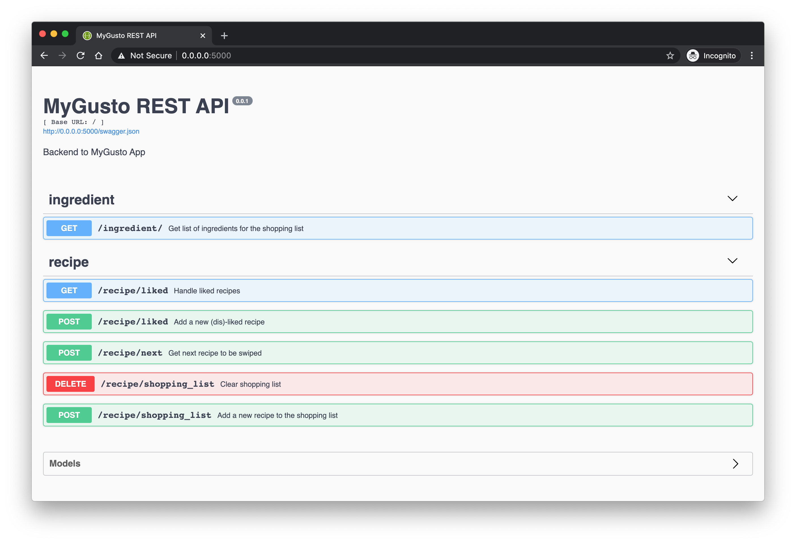

# MyGusto Backend
MyGusto is an app that uses artificial intelligence to cater personalized Migusto recipes to users.
This repository contains the backend and API to the app and interacts with Migros' APIs.

The front end of this application can be found here: [mygusto-app](https://github.com/jhuwyler/mygusto-app)

## Quickstart Guide
To run this locally, simply set up docker on your machine and call `docker-compose up --build` from the root of this repository.
This will start a Postgres database and build and start the Flask API, that will run on http://0.0.0.0:5000. 

To run this on a server, make sure that gunicorn is installed. Build the docker image and execute it in gunicorn.

## API

For the API documentation, refer to the Swagger interface and the code comments.

## Recommender System
To recommend new recipes to users, we propose to use a traditional recommender system that relies on the likes and dislikes of other users.
The app builds a preference profile with every swipe you take and proposes you recipes that users with similar profiles liked before.

The problem with such a system is bootstrapping.
What to do when we have no such data yet, or when a new user without a preference profile joins.
In this case, we revert back to a system that initially randomly proposes a number of recipes and then uses the first few swipes of a user in conjunction with a similarity notion between recipes to present similar recipes to the ones the user liked.

The first system was not yet built as we have no collected data yet.
The second system was build using a KNN classifier with hand picked features.

## Database Migrations
To create a new migration with Flask-Migrate it's easiest to start the server locally. You can then execute the migrate command like this: `docker-compose run app flask db migrate --message "ADD MIGRATION COMMENT"`.
